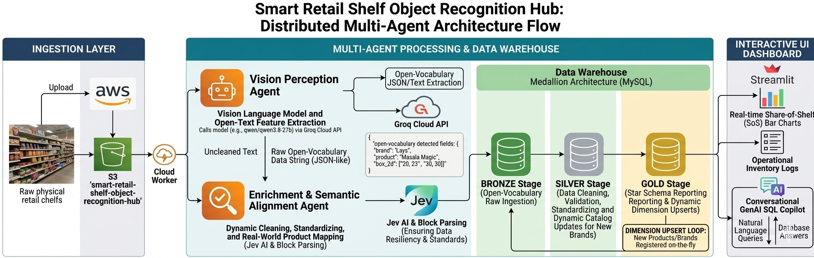
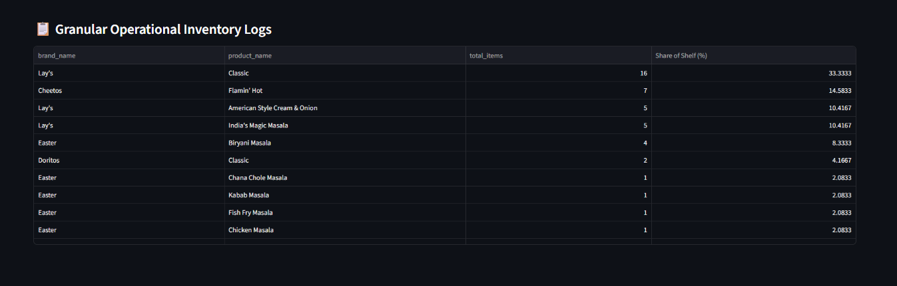

# Smart Retail Shelf Object Recognition Hub

The Smart Retail Shelf Object Recognition Hub is an automated, event-driven multi-agent data engineering pipeline. The project captures raw physical storefront retail shelf images uploaded directly to an AWS cloud environment, processes those assets using top-tier Vision Language Models (VLMs) via an **Open-Vocabulary approach**, applies clean structural data quality algorithms, and surfaces active tracking indicators inside a custom analytics web interface dashboard.

## 🌟 Key Business & System Benefits

- **Open-Vocabulary Scaling:** Completely eliminates hardcoded category limits. The system dynamically reads real-world brand names and product descriptions straight from package designs on the fly.
- **Dynamic Dimension Cataloging:** Automatically updates your data warehouse lookup catalogs as brand-new products are discovered on storefront shelves.
- **Intelligent Multi-Agent Logic:** Splits file perception, context alignment, and structural storage layers between isolated specialized code components.
- **Star-Schema Query Optimization:** Structures raw image datasets into clean dimension and fact warehouse models, preventing lag inside downstream frontend application tools.
- **Conversational GenAI Interface:** Hosts an AI-powered Copilot that lets corporate managers ask questions about shelf inventories in pure natural language chat.

---

## 🚀 Distributed Multi-Agent Architecture Flow



1. **Ingestion Layer**: Images are dropped into a secure Amazon Web Services (AWS) S3 bucket (`smart-retail-shelf-object-recognition-hub`).
2. **Perception Agent**: A cloud worker intercepts the event drop, fetches the image array bytes from S3, and calls a fast Vision Language Model (`qwen/qwen3.8-27b`) via the Groq Cloud API using a fine-tuned, rate-limit optimized completion window to isolate product bounds.
3. **Validation & Enrichment Agent**: Passes the raw bounding boxes through custom regex block-repair algorithms and the **Jev AI API tool** to dynamically clean input text formatting noise, repair unclosed JSON streams, and remove typos.
4. **Data Warehouse Medallion Architecture (MySQL)**:
   - **Bronze Stage**: Records raw open-text data logs directly from the cloud tools.
   - **Silver Stage**: Applies a custom Non-Maximum Suppression (NMS) spatial filter to deduplicate overlapping box coordinates and filters low-confidence outputs.
   - **Gold Stage**: Automatically processes upserts to register new items and aggregates verified entries into an optimized Star Schema (Fact, Store, Product, and Calendar tables) for instant reporting.
5. **Interactive UI Dashboard**: Streamlit reads your Gold analytical schema layers to draw real-time Share-of-Shelf (SoS) bar charts and exposes a conversational GenAI SQL Copilot enabling users to query the database using plain natural language chat.

---

## 📸 System UI & Dashboard Overview

Below are the updated operational logs and data visualizations tracking your real-time retail assets, processed directly from your cloud storage through the dynamic multi-agent warehouse pipelines:

### 1. GenAI Copilot: Conversational Natural Language SQL Chat Interface


### 2. Ingestion & Perception Accuracy Pipeline Analytics


### 3. Granular Operational Warehouse Inventory Logs


### 4. Direct Database Row Mapping & Pipeline Telemetry



---

## 🛠️ Repository File Structure

```text
Smart_Retail_Shelf_Object_Recognition_Hub/
├── agent_layers/
│   ├── ingestion_agent.py      # Manages structural transactional MySQL connection pools
│   ├── perception_agent.py     # Connects to S3 bucket streams and runs Groq open-vocabulary vision calls
│   └── validation_agent.py     # Resilient regex-based block parser and Jev AI semantic alignment
├── database_layers/
│   ├── schema_setup.sql        # Unified database initialization and table drop DDL script
│   ├── gold_transform.py       # Open-world upsert system tracking dynamic facts/dimensions
│   └── silver_transform.py     # Quality Audit agent running spatial NMS deduplication
├── lambda_function/
│   └── lambda_handler.py       # Cloud serverless handler synchronized with open-text schemas
├── app.py                      # Streamlit interactive application core and GenAI SQL Copilot
├── pipeline_ingest.py          # Orchestrates multi-agent ingestion pipeline loops
├── run_pipeline.py             # Master automation script running all components sequentially
├── requirements.txt            # Isolated project dependency configuration requirements
├── Dockerfile                  # Production container recipe configuration parameters
├── .dockerignore               # Excludes environment parameters and local caches from image build
└── .gitignore                  # Prevents environment files and Word documents from tracking
```

---

## ⚡ Step-by-Step Setup & Project Execution Guide

Follow these exact technical steps sequentially to spin up the full pipeline interface inside your local environment:

### 1. Build and Activate the Isolated Virtual Environment Sandbox

Open your standard Windows **Command Prompt (cmd.exe)** at the project root directory path (`D:\2026\newstudy\projects\Smart_Retail_Shelf_Object_Recognition_Hub`) and execute:

```cmd
python -m venv venv
venv\Scripts\activate.bat
pip install -r requirements.txt
```

### 2. Configure Your Secure Environment Credentials File

Open the file named `.env` in your root project folder using VS Code and save your active programmatic key tokens securely:

```text
DB_HOST=localhost
DB_USER=root
DB_PASSWORD="your password"
DB_NAME=retail_shelf_analytics
AWS_ACCESS_KEY_ID=YOUR KEY ID
AWS_SECRET_ACCESS_KEY=YOUR SECRET KEY
AWS_REGION=ap-south-1
S3_BUCKET_NAME=smart-retail-shelf-object-recognition-hub
GROQ_API_KEY=YOUR API KEY
JEV_AI_API_KEY=YOUR JEV API KEY
```

### 3. Initialize the Core Database Warehouse Tables

Execute the consolidated open-world schema definitions inside your active MySQL Command Line Client to initialize the underlying repository environment layout cleanly:

```cmd
mysql -u root -p < database_layers/schema_setup.sql
```

### 4. Execute the Automated Multi-Agent Processing Pipeline

Drop your retail store shelf images into your live S3 bucket, then run your single master orchestration manager script inside your Command Prompt window to execute all backend tiers automatically with a single command:

```cmd
python run_pipeline.py
```

### 5. Launch the Streamlit Frontend Application Interface Hub

Spin up the local development web server to run your dashboard charts and open up your conversational chat copilot:

```cmd
streamlit run app.py
```

---

## 🐳 Execution Method 2: Docker Containerization Setup

To deploy this application seamlessly in an isolated sandbox environment without configuring python or packages manually on the host system, use Docker.

### 1. Configure Host Database Routing

Because the application runs inside an isolated container grid, it cannot use `localhost` to connect to a database running on your host machine. Open your local `.env` file and change the `DB_HOST` parameter to match the Docker internal bridge gateway route:

```text
DB_HOST=host.docker.internal
```

### 2. Compile and Build the Container Image

Ensure you have Docker Desktop running, open your Windows Command Prompt at the repository root folder, and execute this command to compile the production image:

```cmd
docker build -t retail_shelf_hub .
```

### 3. Spin Up and Launch the Container Environment

Run this containerization command block to pass your local environment credentials directly into the application thread and expose the system interface:

```cmd
docker run -d -p 8501:8501 --env-file .env --name retail_shelf_app retail_shelf_hub
```

### 4. Open the Active Application Page View

Once the image initializes successfully, open your web browser and navigate directly to:

```text
http://localhost:8501
```

The entire application layer metrics dashboard and GenAI Copilot query interface will operate completely containerised inside Docker!
