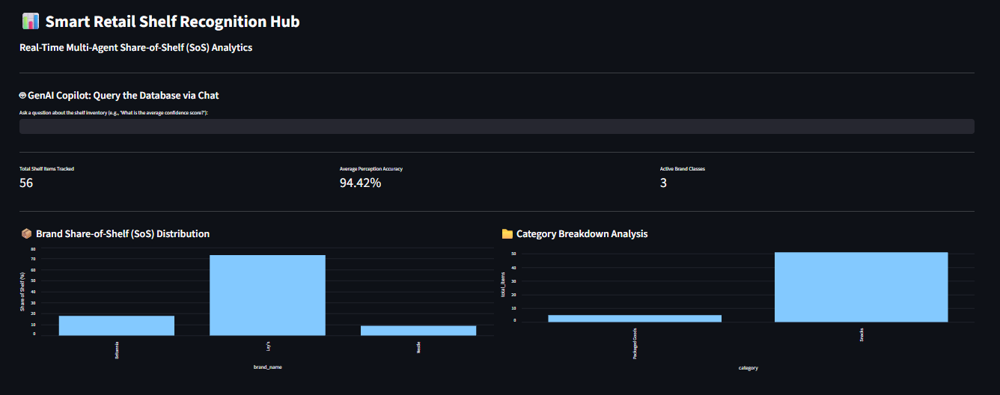
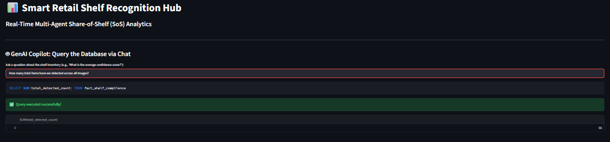
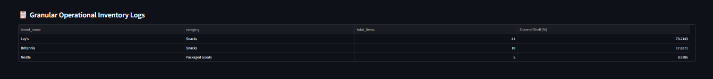

# Smart Retail Shelf Object Recognition Hub

An automated, event-driven Multi-Agent AI Data Pipeline that converts physical retail shelf images into structured analytical insights using cloud inference vision models, Jev AI semantic layer validation, and a Python-native Streamlit metrics dashboard interface.

---

## 📸 System UI & Dashboard Overview

Below are the operational logs and data visualizations tracking your real-time retail assets, processed directly from your cloud storage through the multi-agent warehouse pipelines:

### 1. Ingestion & Perception Accuracy Pipeline Analytics



### 2. GenAI Copilot: Conversational Natural Language SQL Chat Interface



### 3. Granular Operational Warehouse Inventory Logs



---

## 🚀 Distributed Multi-Agent Architecture Flow

1. **Ingestion Layer**: Images are dropped into a secure Amazon Web Services (AWS) S3 bucket (`smart-retail-shelf-object-recognition-hub`).
2. **Perception Agent**: A cloud worker intercepts the event drop, fetches the image array bytes from S3, and calls a fast Vision Language Model (`qwen/qwen3.8-27b`) via the Groq Cloud API to isolate product coordinates.
3. **Validation & Enrichment Agent**: Passes the raw bounding boxes through the **Jev AI API tool** to dynamically clean input text formatting noise, fix ambiguities, and map numerical IDs to real brands.
4. **Data Warehouse Medallion Architecture (MySQL)**:
   - **Bronze Stage**: Records the raw coordinate array logs directly from the cloud tools.
   - **Silver Stage**: Applies a custom Non-Maximum Suppression (NMS) spatial filter to deduplicate overlapping box coordinates and filters low-confidence outputs.
   - **Gold Stage**: Aggregates verified entries into an optimized Star Schema (Fact, Store, Product, and Calendar tables) for instant reporting.
5. **Interactive UI Dashboard**: Streamlit reads your Gold analytical schema layers to draw real-time Share-of-Shelf (SoS) bar charts and exposes a conversational GenAI SQL Copilot enabling users to query the database using plain natural language chat.

---

## 🛠️ Repository File Structure

```text
Smart_Retail_Shelf_Object_Recognition_Hub/
├── agent_layers/
│   ├── ingestion_agent.py      # Manages structural transactional MySQL connection pools
│   ├── perception_agent.py     # Connects to S3 bucket streams and runs Groq vision calls
│   └── validation_agent.py     # Integrates Jev AI API tool for semantic catalog mapping
├── database_layers/
│   ├── bronze_schema.sql       # Initial ingestion lookup schema DDL script
│   ├── gold_schema.sql         # Fact and Dimension star-schema definitions DDL script
│   ├── gold_transform.py       # Aggregates clean Silver rows into your Gold schema
│   └── silver_transform.py     # Quality Audit agent running spatial NMS deduplication
├── app.py                      # Streamlit interactive application core and GenAI SQL Copilot
├── pipeline_ingest.py          # Orchestrates multi-agent ingestion pipeline loops
├── run_pipeline.py             # Master automation script running all components sequentially
├── requirements.txt            # Isolated project dependency configuration requirements
├── .gitignore                  # Prevents environment files and Word documents from tracking
├── image_DV9tm4.png            # Main analytics dashboard dashboard visualization screenshot
├── image_HGmrWi.png            # GenAI Copilot SQL execution text box chat screenshot
└── image_Locd7S.png            # Granular operational inventory table grid screenshot
```

---

## ⚡ Step-by-Step Setup & Project Execution Guide

Follow these exact technical steps sequentially to spin up the full pipeline interface inside your local environment:

### 1. Build and Activate the Isolated Virtual Environment Sandbox

Open your standard Windows **Command Prompt (cmd.exe)** at the project root directory path (`D:\2026\newstudy\projects\Smart_Retail_Shelf_Object_Recognition_Hub`) and execute:

```cmd
python -m venv venv
venv\Scripts\activate.bat
pip install -r requirements.txt
```

### 2. Configure Your Secure Environment Credentials File

Open the file named `.env` in your root project folder using VS Code and save your active programmatic key tokens securely:

```text
DB_HOST=localhost
DB_USER=root
DB_PASSWORD="your password"
DB_NAME=retail_shelf_analytics
AWS_ACCESS_KEY_ID=YOUR KEY ID
AWS_SECRET_ACCESS_KEY=YOUR SECRET KEY
AWS_REGION=ap-south-1
S3_BUCKET_NAME=smart-retail-shelf-object-recognition-hub
GROQ_API_KEY=YOUR API KEY
JEV_AI_API_KEY=YOUR JEV API KEY
```

### 3. Initialize the Core Database Warehouse Tables

Execute the target schema definitions inside your active MySQL Command Line Client to initialize the underlying repository environment:

```cmd
mysql -u root -p"YOUR PASSWORD" < database_layers/bronze_schema.sql
mysql -u root -p"YOUR PASSWORD" < database_layers/gold_schema.sql
```

### 4. Execute the Automated Multi-Agent Processing Pipeline

Drop your retail store shelf images into your live S3 bucket, then run your single master orchestration manager script inside your Command Prompt window to execute all backend tiers automatically with a single command:

```cmd
python run_pipeline.py
```

### 5. Launch the Streamlit Frontend Application Interface Hub

Spin up the local development web server to run your dashboard charts and open up your conversational chat copilot:

```cmd
streamlit run app.py
```
